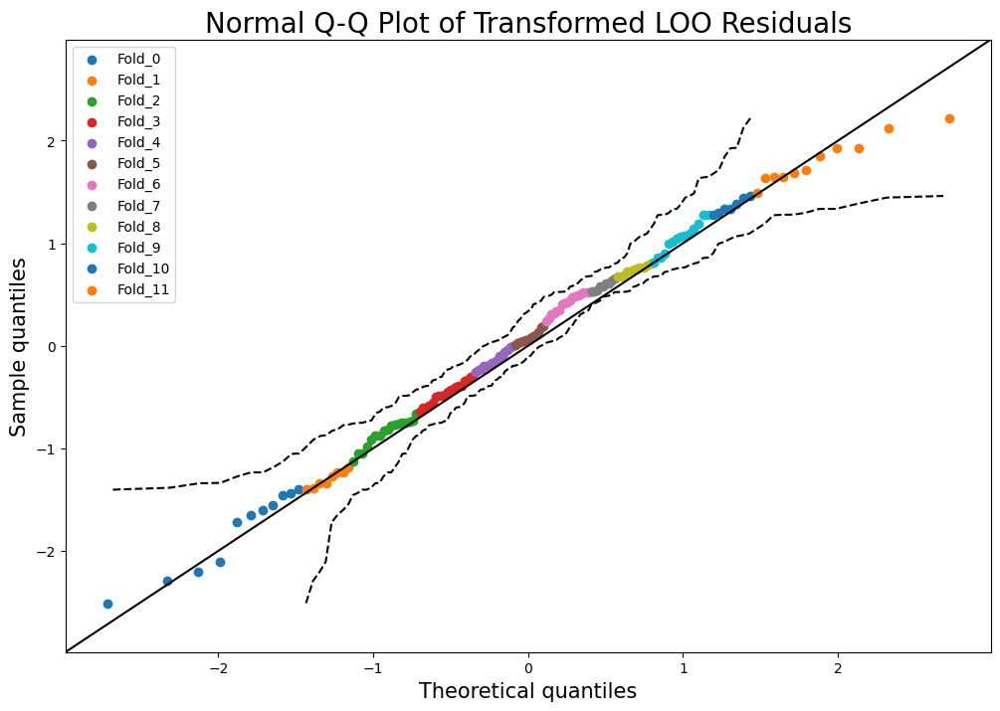

# gp-diagnostics

**gp-diagnostics** is a Python library for diagnosing Gaussian Process (GP) models. It provides tools for advanced
cross-validation, residual analysis, and visualization to support the evaluation and interpretation of GP regression
models.



---

## Key Features

- **Cross-Validation**  
  - **Leave-One-Out (LOO)** or **Multifold** CV for GP regressions with optional fixed observational noise.  
  - Fast computation of CV residuals (including covariance) based on the approach by
  [Ginsbourger and Schaerer (2021)](https://arxiv.org/abs/2101.03108).  
  - Cholesky-based implementations with fallback checks for matrix definiteness.

- **GP Evaluation Metrics**  
  - Functions to compute **log marginal likelihood**, **pseudo-likelihood** (for CV), and **mean squared error**.  
  - Easy integration with existing GP code to measure model performance and residual normality.

- **Diagnostic Plots**
  - **Histogram of residuals**, **QQ plots**, **predictions vs. true** values, and more.  
  - Interactive **Plotly** figures for easy exploration and diagnostics.

---

## Installation

Below are two ways to install **gp-diagnostics** into your current project (using `pip` or
[`uv`](https://docs.astral.sh/uv/)). Since the package is not yet published on PyPI, you must install directly from this
repository.

---

### Option 1: Install with `uv` (recommended)

```bash
uv add "gp-diagnostics @ git+https://github.com/dnv-opensource/gp-diagnostics"
```

### Option 2: Install with `pip`

```bash
pip install git+https://github.com/dnv-opensource/gp-diagnostics
```

> **Note**
> - The two options above install **only** the core dependencies required to use the package, see below for development
>   installation.

## Development Installation

If you plan to contribute to the package, or need the development dependencies (e.g. to run the examples), you should do 
the following:

```bash
git clone https://github.com/dnv-opensource/gp-diagnostics.git
cd gp-diagnostics
uv sync
```

---

## Usage

See [examples/example.ipynb](examples/example.ipynb) and [examples/exact_gp_example.ipynb](examples/exact_gp_example.ipynb) for detailed usage examples.

---

## Core Modules

**1. `cv.py`**  
- `loo()`: Leave-One-Out CV residuals and covariance.  
- `multifold()`: Multifold CV for grouped data (e.g., multiple time series).  
- Both handle GP prior covariance plus optional noise variance.

**2. `metrics.py`**  
- `evaluate_GP()`: Calculates log marginal likelihood, pseudo-likelihood, and MSE.  
- `log_prob_normal()` and `log_prob_standard_normal()`: Useful log probability helpers.

**3. `plots.py`**  
- Plotly-based functions to visualize residuals (histogram, QQ), predictive intervals, etc.  
- `qq_residuals()`, `hist_residuals()`, `pred_vs_error()`, and more for quick diagnostics.

**4. `utils`**  
- **`checks.py`**: Validations (e.g., numeric array, lower-triangular).  
- **`linalg.py`**: Cholesky utilities, triangular solves, matrix inversion.  
- **`stats.py`**: QQ data generation, partitioning data folds, etc.

---

## Contributing

Please feel free to open [issues](https://github.com/dnv-opensource/gp-diagnostics/issues) or submit pull requests if
you have ideas for improvements or bug fixes.  

For local development:

1. [Fork](https://github.com/dnv-opensource/gp-diagnostics/fork) or clone the repository.  
2. Create a feature branch: `git checkout -b feature/new-idea`.  
3. Implement your changes and add tests.  
4. Submit a pull request to `main` when ready.

---

## Testing

All tests live under the `tests/` directory. To run them:

```bash
# With pytest:
pytest

# Or with tox (runs multiple Python versions, if available):
tox
```

---

## Authors

- Christian Agrell ([christian.agrell@dnv.com](mailto\:christian.agrell@dnv.com))
- Magnus Kristiansen ([magnus.kristiansen@dnv.com](mailto\:magnus.kristiansen@dnv.com))

---

## License

[MIT License](LICENSE)  
&copy; 2024 [DNV](https://www.dnv.com). See [LICENSE](LICENSE) for details.

---
